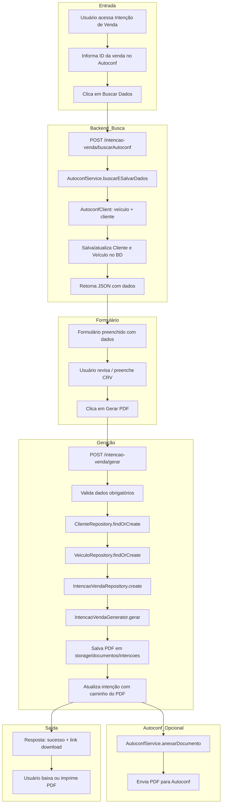
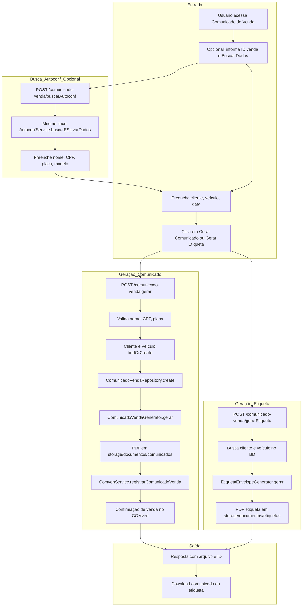
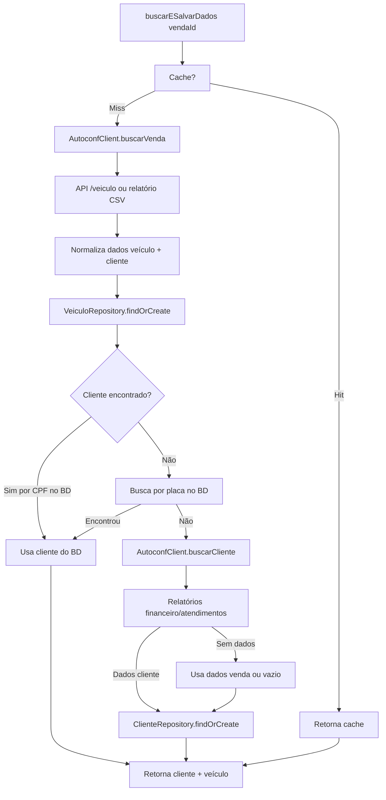
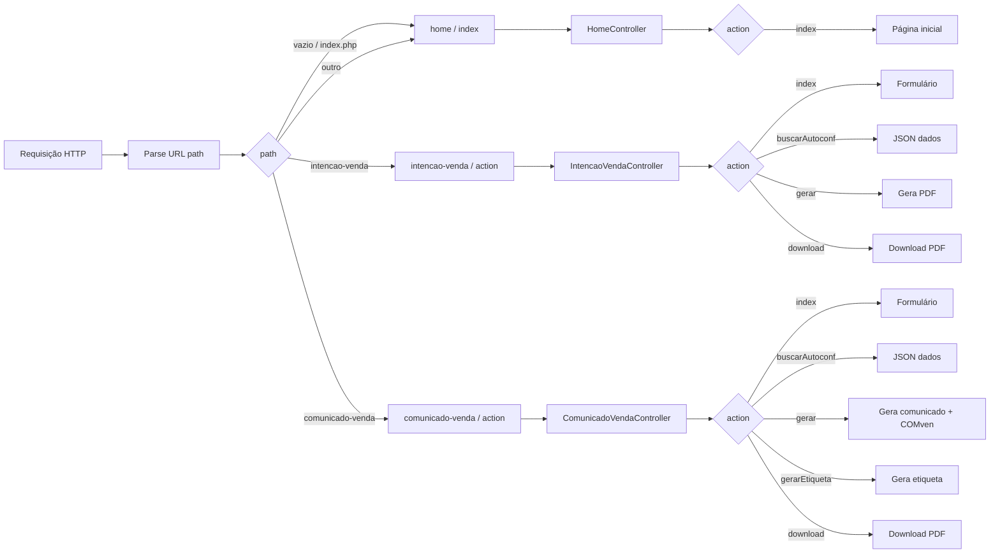
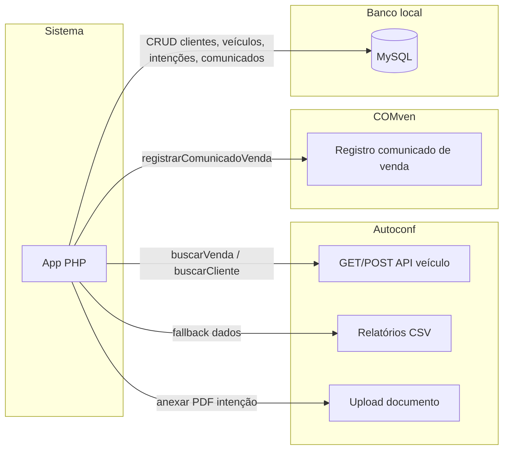

# Fluxograma do Sistema – Gestão de Vendas e Comunicações de Motocicletas

Diagramas em [Mermaid](https://mermaid.js.org/). Para visualizar: abra no VS Code com extensão Mermaid, no GitHub, ou use [mermaid.live](https://mermaid.live).

---

## 1. Visão geral – Navegação e roteamento

```mermaid
flowchart TD
    A[Usuário acessa o sistema] --> B{URL / rota}
    B -->|/ ou /home| C[HomeController]
    B -->|/intencao-venda| D[IntencaoVendaController]
    B -->|/comunicado-venda| E[ComunicadoVendaController]
    
    C --> F[Página Inicial]
    F --> G[Links: Intenção de Venda | Comunicado de Venda]
    
    D --> H[Formulário Intenção de Venda]
    E --> I[Formulário Comunicado de Venda]
    
    G --> D
    G --> E
```

---

## 2. Fluxo completo – Intenção de Venda



---

## 3. Fluxo completo – Comunicado de Venda



---

## 4. Busca de dados no Autoconf (buscarESalvarDados)



---

## 5. Roteamento (index.php na raiz)



---

## 6. Integrações externas (resumo)



---

## Legenda rápida

| Elemento        | Significado                                      |
|-----------------|--------------------------------------------------|
| **Intenção de Venda** | Documento inicial: cliente declara intenção com dados do veículo e CRV. |
| **Comunicado de Venda** | Documento e etiqueta para envio; pode registrar no COMven. |
| **Autoconf**    | Origem dos dados da venda (veículo e, quando há, cliente). |
| **COMven**      | Confirmação/registro do comunicado de venda (se configurado). |
| **BD**          | Banco de dados local (clientes, veículos, intenções, comunicados). |

Para ver os diagramas renderizados: use a extensão **Mermaid** no VS Code ou cole o bloco de código em [mermaid.live](https://mermaid.live).
